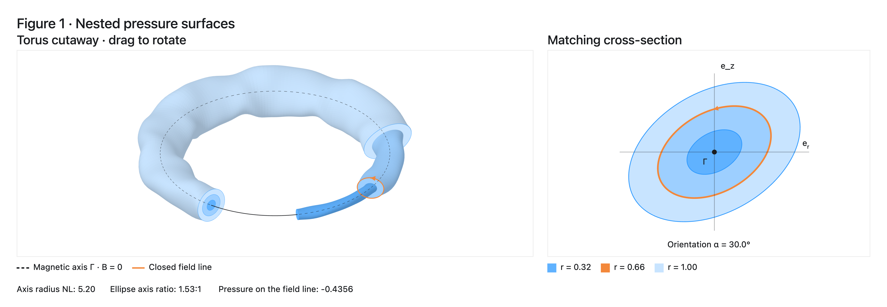

# Counterexamples to Grad's conjecture

This repository contains a Lean 4 formalization of the main result of the paper [*Counterexamples to Grad's conjecture*](https://arxiv.org/abs/2609.24739) by **Javier Gómez-Serrano**, **Lukas Liehr** and **Mitchell A. Taylor**. The mathematical statement that is formalized in Lean reads as follows.

**Theorem.** Fix a cell length $L>0$. There are a compact interval $I\subset(0,\tfrac12)$ with nonempty interior and an integer $N_0\geq1$ such that, for every $N\geq N_0$, there is a smooth family of embedded solid tori carrying smooth magnetohydrostatic equilibria $(B_{N,\lambda},P_{N,\lambda})$, indexed by $\lambda\in I$, with the following properties:

1. The pressure has precisely the round critical circle of radius $NL$, and its regular levels are embedded tori foliating the complement of that circle.
2. The magnetic field vanishes precisely on that circle.
3. The full signed Euclidean stabilizer is exactly the cyclic group of $N$ rotations about the axis.
4. The family gives a continuous injective curve in the moduli space of embedded configurations, for every finite $C^k$ regularity with $k\geq3$ and for $C^\infty$. Its interior members are non-isolated.

The fields satisfy $B\times(\nabla\times B)+\nabla P=0$ and $\nabla\cdot B=0$, and $B$ is tangent to the boundary. The moduli statement concerns varying embedded domains, with the equivalence relation specified in the paper and the showcase.

<p align="center">
  <a href="https://lukasliehr.github.io/Grad-Conjecture/InteractivePlot/"><strong>Open the interactive figure</strong></a>
</p>

<p align="center">
  <a href="https://lukasliehr.github.io/Grad-Conjecture/InteractivePlot/">
    
  </a>
</p>

## Lean entry points

- [Showcase.lean](Showcase.lean): a self-contained formulation of the result and its definitions. It imports only Mathlib and uses two `sorry` placeholders for the presentation proofs.
- [Showcase_WithProofs.lean](Showcase_WithProofs.lean): the companion of Showcase.lean where each `sorry` is replaced with a proof. It imports the verified library, reuses its definitions through the paper-facing abbreviations, and proves both showcase statements without `sorry`.

The two showcases are alternative presentations and should not be imported together. Their declarations are compared by the checks in `Comparator/`. The proved main result depends only on the standard axioms `propext`, `Classical.choice`, and `Quot.sound`.

## Repository layout

- [LeanCode/](LeanCode/README.md): the complete accepted proof library, organized into Nash–Moser iteration, smooth dependence, Fourier analysis, analytic weights and inverses, Banach calculus, topology, the MHS application, and supporting analysis. Each topic has a mathematical guide.
- [Comparator/](Comparator/README.md): checks of the displayed definitions, theorem statements, equivalence with the expanded statement, and transitive proof dependencies, together with a guide to the paper–Lean correspondence.


## Mathematics in LeanCode

The folders in LeanCode follow the mathematical components of the proof. Their individual guides link to the definitions and theorems used in the corresponding folder.

- **[NashMoser/](LeanCode/NashMoser/README.md)** formalizes the convergence mechanism of the Nash–Moser argument: Newton iteration within a prescribed domain, decay of residuals, summability of corrections, and convergence in completed spaces at each regularity level. It proves compatibility of these limits and, under the stated continuity and realization hypotheses, that the limit solves the original equation. These results provide reusable iteration machinery with explicit analytic hypotheses.

- **[SmoothDependence/](LeanCode/SmoothDependence/README.md)** proves differentiability and smooth parameter dependence of solution branches in families of normed spaces. A remainder estimate involving a low and a higher regularity norm first yields the derivative. Realizing that derivative as a smooth function of the parameter and a higher-regularity branch value then gives smoothness of the branch at every regularity level.

- **[FourierAnalysis/](LeanCode/FourierAnalysis/README.md)** develops Fourier regularity spaces, interpolation inequalities and smoothing operators. In particular, for integer orders $r<s<t$, it proves the constant-one estimate $\|u\|_s\leq\|u\|_r^{1-\theta}\|u\|_t^\theta$, where $\theta=(s-r)/(t-r)$, for the formalized Fourier norms. Smooth Fourier cutoffs satisfy bounds for the gain of regularity, approximation error and derivatives in the smoothing scale. The construction is also transferred to the weighted and constrained spaces used in the paper.

- **[AnalyticAlgebras/](LeanCode/AnalyticAlgebras/README.md)** contains analytic phase weights, their submultiplicative and parameter-derivative estimates, and translation and convolution bounds. It also proves general Neumann-series and perturbation results for bounded linear operators: if $\|T\|<1$, the series $\sum_{n\geq0}T^n$ is a two-sided inverse of $1-T$, with norm at most $(1-\|T\|)^{-1}$.

- **[BanachCalculus/](LeanCode/BanachCalculus/README.md)** treats infinite series of smooth maps between real Banach spaces. Locally summable uniform bounds on derivatives imply locally uniform convergence of the derivative series and justify termwise Fréchet differentiation. The folder also contains the completion data and multilinear constructions used to pass between smooth cores and completed spaces in the application.

- **[Topology/](LeanCode/Topology/README.md)** studies the configuration equivalence relation and quotient topology appearing in the paper, including the identification of quotient equality with the full stated equivalence relation. It also proves a general non-isolation result: a continuous injective curve from a subset of $\mathbb R$ into any topological space has non-isolated image points at interior parameter values. No separation assumption on the target is needed.

- **[Applications/MHS/](LeanCode/Applications/MHS/README.md)** contains the definitions of the embedded configurations and equilibrium properties, the geometric assembly, and the exact main theorem. It brings together the analytic construction, pressure foliation, magnetic axis, symmetry classification and moduli-space argument to establish the result stated above.

- **[Internal/](LeanCode/Internal/README.md)** contains the supporting proofs used by the above topics. [FunctionalAnalysis/](LeanCode/Internal/FunctionalAnalysis/README.md) develops weighted function spaces, tensor and integral estimates, weak derivatives and extension operators. [NonlinearAnalysis/](LeanCode/Internal/NonlinearAnalysis/README.md) treats nonlinear maps, quotient constructions and their differential estimates. [PhysicalAnalysis/](LeanCode/Internal/PhysicalAnalysis/README.md) supplies the equation-specific linear inverse, regularity and tame estimates, and the Newton construction for the original MHS equation.


## Build

The project pins **Lean 4.33.1**. With Git and Lean's toolchain manager `elan` installed, clone the repository and build with Lake:

```sh
git clone https://github.com/lukasliehr/Grad-Conjecture.git
cd Grad-Conjecture
lake exe cache get
lake build Showcase
lake build Showcase_WithProofs
lake build Comparator
```

These commands use the repository's pinned dependencies. `lake exe cache get` downloads Mathlib's compiled cache. The first build of the proved companion compiles this project's proof dependencies.

`lake build Showcase` checks the standalone presentation, `lake build Showcase_WithProofs` checks the proved main result, and `lake build Comparator` checks the declaration correspondence and proof dependencies. Bare `lake build` builds the both of two showcases.
